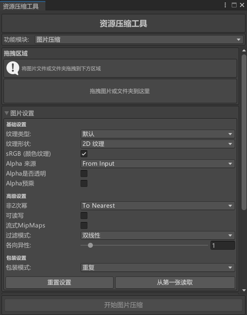
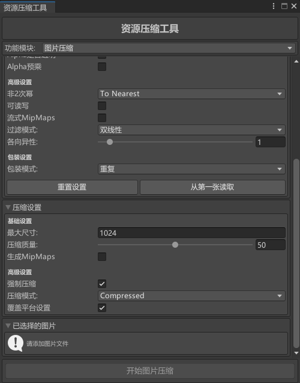

## **资源压缩工具GUI面板**

使用方法：

1. 选择资源压缩模式 - 图片/音频。
2. 将图片/音频文件拖拽到面板的资源拖拽区域 - 支持文件夹拖拽。
3. 设置图片/音频的格式。
4. 设置资源压缩格式 - 这里建议WebGL端纹理尺寸设置为512*512，质量为50%，压缩模式选择Compressed HQ模式。
5. 点击开始压缩按钮。
6. 压缩完成后会显示资源压缩结果。

